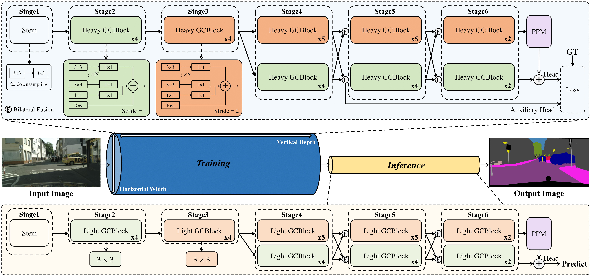

# Golden Cudgel Network for Real-Time Semantic Segmentation ([arXiv]())

By Guoyu Yang, Yuan Wang, Daming Shi*, Yanzhong Wang

This project is based on [mmsegmentation](https://github.com/open-mmlab/mmsegmentation).


# Golden Cudgel Network

<p align="center">
  </br>
</p>
The overall architecture of GCNet. After feature flow into two branches, the upper branch corresponds to the semantic branch, while the lower branch corresponds to the detail branch. The orange box indicates that the first block within the GCBlocks has a stride of 2, while the remaining blocks have a stride of 1. The green box signifies that all GCBlocks maintain a stride of 1.

# Experiment

## Environment
```
python==3.8.19
pytorch==1.12.1
torchvision==0.13.1
mmengine==0.10.2
mmcv==2.0.0
mmsegmentation==1.2.2
```

## Install
Please refer to [mmsegmentation](https://mmsegmentation.readthedocs.io/en/latest/get_started.html) for installation.

## Dataset
```
RDRNet
├── mmsegmentation
├── figures
├── data
│   ├── cityscapes
│   │   ├── leftImg8bit
│   │   │   ├── train
│   │   │   ├── val
│   │   ├── gtFine
│   │   │   ├── train
│   │   │   ├── val
│   ├── CamVid
│   │   ├── train
│   │   ├── train_labels
│   │   ├── test
│   │   ├── test_labels
│   ├── VOCdevkit
│   │   ├── VOC2012
│   │   │   ├── JPEGImages
│   │   │   ├── SegmentationClass
│   │   │   ├── ImageSets
│   │   │   │   ├── Segmentation
├── gcnet-s_4xb3-120k_cityscapes-1024x1024.py
├── train.py
├── test.py
├── torch_speed.py
```

Cityscapes could be downloaded from [here](https://www.cityscapes-dataset.com/downloads/). 
Camvid could be downloaded from [here](https://drive.google.com/file/d/1H69xFbUr_FGUhIU1iWbYpIDyD1EIOJGl/view?usp=sharing). 
Pascal VOC 2012 could be downloaded from [here](http://host.robots.ox.ac.uk/pascal/VOC/voc2012/VOCtrainval_11-May-2012.tar). 


## Training
Single gpu for train:
```shell
CUDA_VISIBLE_DEVICES=0 python ./mmsegmentation/tools/train.py gcnet-s_4xb3-120k_cityscapes-1024x1024.py --work-dir ./weight/seg
```

Multiple gpus for train:
```shell
CUDA_VISIBLE_DEVICES=0,1,2,3 bash ./mmsegmentation/tools/dist_train.sh gcnet-s_4xb3-120k_cityscapes-1024x1024.py 4 --work-dir ./weight/seg
```

Train in pycharm: If you want to train in pycharm, you can run it in train.py.

see more details at [mmsegmentation](https://github.com/open-mmlab/mmsegmentation).

## Testing
```shell
CUDA_VISIBLE_DEVICES=0 python ./mmsegmentation/tools/test.py gcnet-s_4xb3-120k_cityscapes-1024x1024.py ./weight/seg/gcnet_weight.pth
```

Test in pycharm: If you want to test in pycharm, you can run it in test.py.

see more details at [mmsegmentation](https://github.com/open-mmlab/mmsegmentation).

## Results on Cityscapes
|     Method      |  FPS  | Params (M) | GFLOPs | ImageNet |                                            val                                             |
|:---------------:|:-----:|:----------:|:------:|:--------:|:------------------------------------------------------------------------------------------:|
|    BiSeNetV1    | 116.8 |    13.3    | 118.0  | &#10003; |                                            74.4                                            |
|    BiSeNetV2    | 132.4 |    3.4     |  98.4  | &#10007; |                                            73.6                                            |
| DDRNet-23-Slim  | 166.4 |    5.7     |  36.3  | &#10007; | [76.3](https://drive.google.com/file/d/1x4vvs6RZdTosihTf6qTy2xbD5x5GThE9/view?usp=sharing) |
|    DDRNet-23    | 106.0 |    20.3    | 143.0  | &#10007; | [78.0](https://drive.google.com/file/d/1cQt0kqzEgLXOg_arCO4Xn7O7aMOpFvbJ/view?usp=sharing) |
|    PIDNet-S     | 128.7 |    7.7     |  47.3  | &#10007; | [76.4](https://drive.google.com/file/d/1SboDHBgL6gwFJuh3Jh_DLVeXA1L03DT9/view?usp=sharing) |
|    PIDNet-M     | 78.2  |    28.7    | 177.0  | &#10007; | [78.2](https://drive.google.com/file/d/1GBigZvlMEBFG-yval93TEgn-GCHPDDH_/view?usp=sharing) |
|    PIDNet-L     | 64.2  |    37.3    | 275.0  | &#10007; | [78.8](https://drive.google.com/file/d/11BX-QiA9sbNmJdF-3aH6Ux9yNp4jKwbX/view?usp=sharing) |
| SCTNet-S-Seg50  | 169.1 |    4.6     |  7.1   | &#10007; |                                            71.0                                            |
| SCTNet-S-Seg75  | 168.7 |    4.6     |  16.0  | &#10007; |                                            74.7                                            |
| SCTNet-B-Seg50  | 162.6 |    17.4    |  28.1  | &#10007; |                                            75.0                                            |
| SCTNet-B-Seg75  | 157.3 |    17.4    |  63.2  | &#10007; |                                            78.5                                            |
| SCTNet-B-Seg100 | 117.0 |    17.4    | 112.3  | &#10007; |                                            79.0                                            |
|    RDRNet-S     | 182.6 |    7.3     |  43.4  | &#10007; | [76.8](https://drive.google.com/file/d/14rr7XOCNlzCgpLMuVNLUTB39gIxkTBx3/view?usp=sharing) |
|    RDRNet-M     | 102.8 |    26.0    | 162.0  | &#10007; | [78.8](https://drive.google.com/file/d/1dpn7cDdFG9qGbc65irFPUx1QTeTh3DqP/view?usp=sharing) |
|    RDRNet-L     | 76.1  |    36.9    | 238.0  | &#10007; | [79.6](https://drive.google.com/file/d/1eyftoe0js4BGVXQEJgWmJ1NgUnjXhZnt/view?usp=sharing) |
|     GCNet-S     | 193.3 |    9.2     |  45.2  | &#10007; | [76.9](https://drive.google.com/file/d/1KersBP95k3b0AELiYlQ1rk4PKUmN-ueu/view?usp=sharing) |
|  GCNet-S (N=4)  | 193.3 |    9.2     |  45.2  | &#10007; |                                            77.3                                            |
|     GCNet-M     | 105.0 |    34.2    | 178.0  | &#10007; | [79.0](https://drive.google.com/file/d/1sRaoMBirNeOlzV7DSJrML37k6Ypm4E7n/view?usp=sharing) |
|     GCNet-L     | 88.0  |    45.2    | 232.0  | &#10007; | [79.6](https://drive.google.com/file/d/1FCQJB0kRni7PoMTkLOjzuPi9KI868XB6/view?usp=sharing) |

When performing inference on A100, the image resolution used was 1024 &#10005; 2048. In the table, GCNet defaults to setting N to 2.


# Citations

If you find GCNet useful in your research, please consider citing:
```

```
